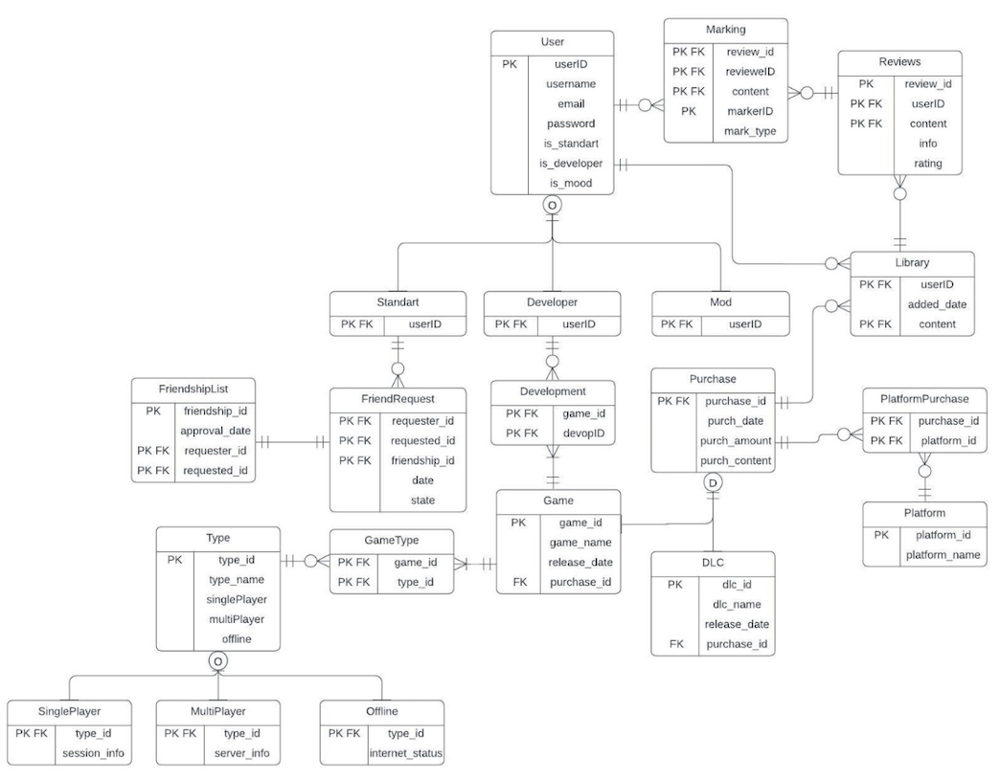

# SPLAY – Game Platform Database System

This project was created for the Database Management Systems course. It models a simple game platform similar to Steam and focuses on managing users, games, and purchases using a relational database design.

## Features
- Relational database schema for users, games, and purchase records
- SQL operations for inserting, updating, and querying data
- Minimal interface using HTML and Node.js to test database interactions
- No CSS was used; the focus was entirely on backend and database logic

## Technologies Used
- PostgreSQL
- Node.js
- HTML (basic, no CSS)

## Database Structure
Below is an example of the table relationships and design used in the project:

## What I Learned
- Designing relational database schemas from scratch
- Implementing core CRUD operations with SQL
- Integrating a PostgreSQL database with a basic Node.js backend
- Creating simple UIs for testing purposes without frontend styling

## Notes
This project was developed as the final project for the Database Management Systems course in the first semester of my 2nd year at Sakarya University.
